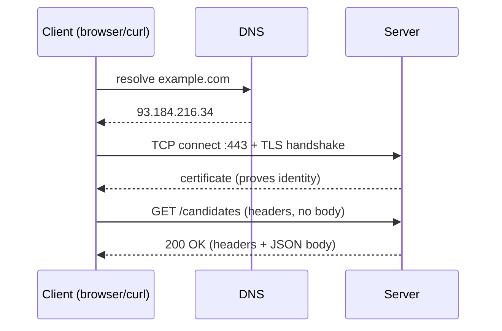

# Module 3 — Networking and the client-server model

> How the web actually works.

## Theory

A request leaves your machine and an answer comes back. Every layer below makes that possible.

- **TCP/IP** is the transport: IP addresses route packets to a host, TCP turns those packets into a reliable, ordered stream. A **port** picks which program on the host receives the stream (80 for HTTP, 443 for HTTPS).
- **DNS** turns a name (`example.com`) into an IP address, so humans deal in names and machines deal in numbers.
- **HTTP** is the request-response protocol on top. A request has a **method** (`GET`, `POST`, `PUT`, `DELETE`), a path, **headers** (metadata like `Content-Type`, `Authorization`), and an optional **body**. The response has a **status code**, headers, and a body.
- **Status codes** group by first digit: `2xx` success, `3xx` redirect, `4xx` the client got it wrong (`400`, `401`, `403`, `404`), `5xx` the server got it wrong (`500`, `503`). Knowing these cold is half of API testing.
- **TLS and HTTPS**: port 443 carries HTTP *inside* an encrypted TLS channel. The **handshake** agrees on keys and proves the server's identity with a **certificate** issued by a trusted authority. This is why `https://` means both "encrypted" and "you are talking to who you think you are".

## Exercise

Use **curl** and the browser's **Network tab** to read real traffic — don't just make requests, *read what comes back*.

1. `curl -v https://example.com` and identify: the TLS handshake lines, the request line and headers you sent, the status code and response headers you got.
2. `curl -i` a JSON API and read the `Content-Type` and body.
3. Make a request that returns `301`/`302` and follow it (`-L`); make one that returns `404`.
4. In the browser Network tab, load a page and explain one request's method, status, and the difference between document, script and fetch/XHR requests.

Worked commands and what to look for in [`solution/`](solution).
