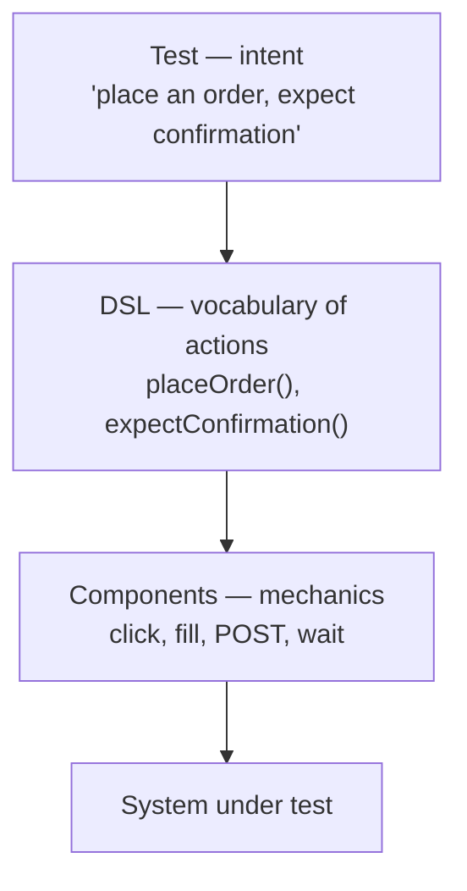

# Module 4 — QA fundamentals and test design

> The mental frame before the tools: how to think about a test.

## Theory

This module has no framework and almost no code. It is the thinking the rest of the path stands on. Three ideas.

### Testing is not checking

The distinction is **Michael Bolton and James Bach's**, from *Rapid Software Testing* (their 2013 essay *Testing and Checking Refined*):

- A **check** is an observation with a decision rule that a machine can make: *given this input, is the output exactly this?* Checks are confirmatory and automatable. Most of what we call "automated tests" are checks.
- **Testing** is the human activity around the checks: exploring, questioning, modelling, learning. It decides *what is worth checking*, notices what no one thought to check, and updates your mental model of the system every time the app surprises you.

You cannot automate testing. You can automate checks — but only testing tells you which checks are worth having. Both matter; confusing them is how teams end up with a thousand green checks and no confidence.

### Risk and oracles

- **Risk** is where the cost of being wrong is highest. You can never check everything, so you spend your effort where failure would hurt most — the payment step, not the footer copyright year.
- An **oracle** is how you decide a result is right or wrong: a spec, a comparable system, a consistent rule ("the total should equal the sum of line items"), or a user's expectation. Every check needs an oracle, explicit or not. Naming yours is what stops "it ran without error" from masquerading as "it works".

### Choosing cases, not guessing

Two classic techniques turn "I'll try some values" into a defensible set:

- **Equivalence partitioning**: split the inputs into classes that should behave the same, and test one value from each. An age field might partition into *too young*, *valid*, *too old*, *non-numeric* — four cases instead of forty.
- **Boundary values**: bugs cluster at the edges. If valid age is 18–99, test 17/18 and 99/100, not just 50.

These get applied for real in modules 10–15.

### Intent over mechanics

One idea runs through every testing module: a test should say **what** it verifies, not **how** it drives the system. "A customer places an order and it is confirmed" is the intent; the clicking, posting and waiting are mechanics that belong underneath, out of sight. Hold the two apart and a test reads as a specification of behaviour rather than a script that happens to pass — and the suite survives a change to the UI or the wiring beneath it.

The same principle at every level:

- against the **UI**, it becomes the Page Object Model (module 11) — a page exposes `submitApplication()`, not raw selectors;
- against an **API**, it becomes a declarative call (module 10) — name the endpoint, send the payload, assert the outcome.

Dave Farley pushes it furthest with a four-layer separation — the test, a domain language (DSL) of actions, the components that perform them, and the system itself — so the same readable scenarios outlive a rewrite of everything below. You don't build a DSL here; you just learn to see the **seam between intent and mechanics** before a framework hides it.

## Exercise

Take a real user intent — **placing an order**: add to cart, check out, pay, confirm.

1. **Test it first.** Walk the flow as if you'd never seen it. Each time it surprises you, write down what could go wrong and what actually matters. This is the exploring that keeps changing your mental model — and you can't script it in advance.
2. **Then design the checks.** Decide:
   - Should *one* automated test drive the whole flow end to end, or should each step earn its own check? What does each choice cost, and what does it buy in confidence?
   - Where along the way are the inputs — quantity, address, payment — worth **partitioning** and **bounding**? Write those cases out.
   - Which checks would you actually keep, given they have to run on every change and not turn flaky?
3. For one step, write the **intent** in plain words and, separately, the **mechanics** it would need. See where the line falls.

The skill this builds: naming which half you're in — testing or checking — at any moment.

A worked version in [`solution/`](solution) — do your own first; there's no single right answer, only defensible ones.
