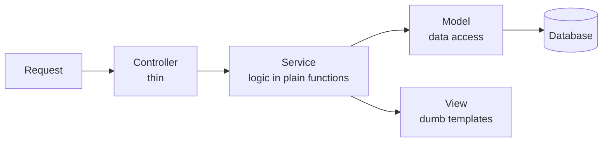

# Module 9 — Structuring the app: the MVC pattern

> Good structure and testability are the same goal seen from two sides.

## Theory

By now you have all three pieces of **MVC**, just tangled together:

- **Model** — the database layer (module 6).
- **View** — the templates (module 8).
- **Controller** — the route handlers (modules 5, 7, 8).

The move is to separate them properly. Business logic comes out of the templates and the route handlers into a **service layer** — plain functions that take inputs and return results. That leaves controllers **thin** (parse the request, call the service, shape the response) and views **dumb** (render what they're handed).

Why this is a testing module, not just an architecture one:

- A service that holds logic in plain functions is what makes **unit tests** possible — no HTTP, no browser, just call the function.
- A thin controller is what keeps the **API layer clean to test** (module 10).
- Isolating data access behind the service **decouples the database** — which is exactly what lets module 6 start on SQLite and move to MySQL later by touching only the model.

## Exercise

Refactor the app so logic lives in a service layer:

- Move candidate logic out of routes and templates into service functions.
- Reduce controllers to: validate input → call service → return response.
- Confirm you can now **unit test** a service function with no server running.

Behaviour must not change — this is a refactor. Lean on the tests if you have them; if not, this shows why you wanted them.

## Solution

See [`solution/`](solution).
