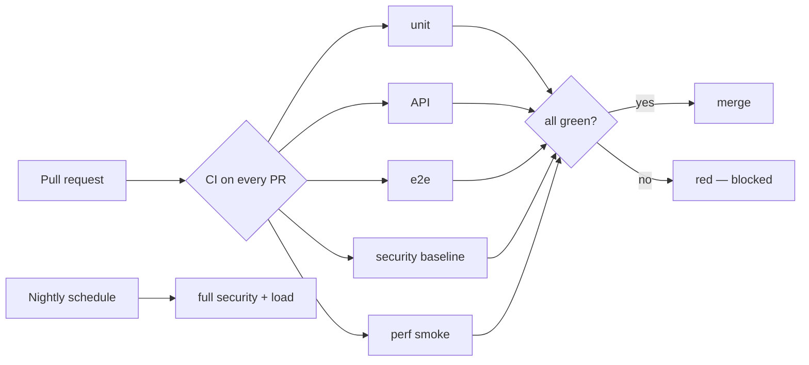

# Module 19 — Continuous integration with GitHub Actions

> Everything running on every pull request, turning red when something breaks.

## Theory

CI is the suite running automatically on every change, so a regression is caught in minutes, not in production.

- A **GitHub Actions workflow** is YAML in `.github/workflows/`: triggered on push/PR, it checks out the code, brings up the stack (the Docker work from module 18), and runs the tests.
- **What runs on every PR**: the fast, decisive checks — unit, API, end-to-end, the security baseline, and a performance **smoke** check. The PR goes **red** when any fail.
- **Fast feedback vs thorough coverage**: the heavy security and load runs are slow, so they sit on a **nightly schedule** rather than every push. Learning where to draw that line — quick signal on every change, deep coverage overnight — is the lesson.
- A green CI run is the gate: nothing merges to `main` without it.

## Exercise

- Write a GitHub Actions workflow that, on every PR, brings up the stack and runs unit + API + e2e + security baseline + a perf smoke.
- Put the **full** security and load runs on a nightly schedule.
- Confirm the signal: push a **deliberate failure** and watch the PR go red, then fix it and watch it go green.

## Solution

See [`solution/`](solution).

## References

- **David Farley**, *Continuous Delivery Pipelines* (2021) — how to design the pipeline that runs the suite on every change. [continuous-delivery.co.uk](https://www.continuous-delivery.co.uk/)
